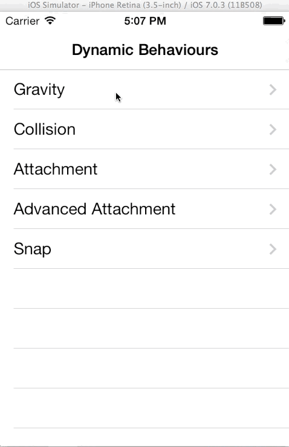
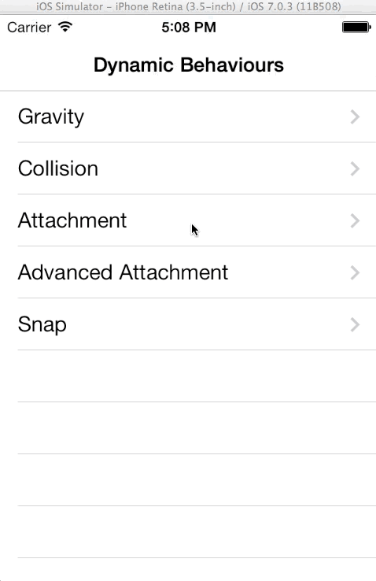
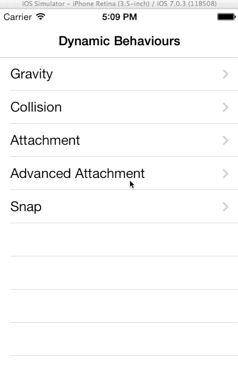
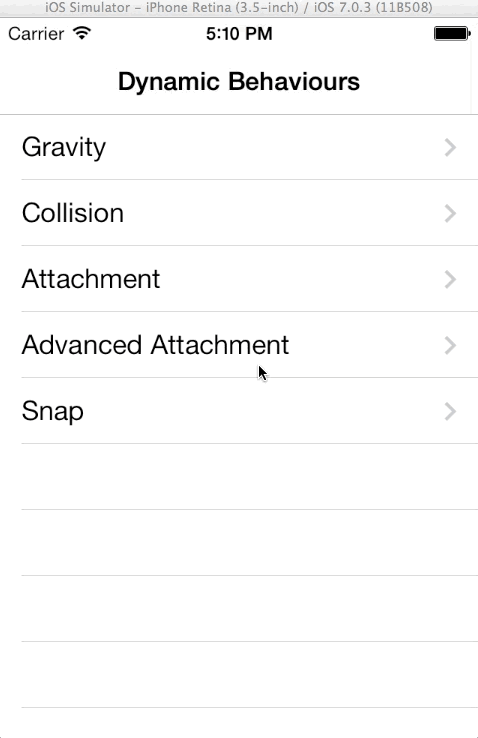
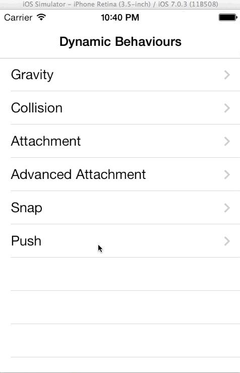

UIDynamicExample
================

This project aims to provide examples of UIDynamic behaviour of iOS7, including:

- Gravity
- Collision
- Attachment
- Snap
- Push

Please see the gifs below for more information:

###Gravity

###Collision

###Attachment

###Advanced attachment

###Snap

###Push

##References:

http://www.shinobicontrols.com/blog/posts/2013/09/19/ios7-day-by-day-day-0-uikit-dynamics/

http://www.raywenderlich.com/50197/uikit-dynamics-tutorial

http://www.teehanlax.com/blog/introduction-to-uikit-dynamics/

http://onevcat.com/2013/06/uikit-dynamics-started/
